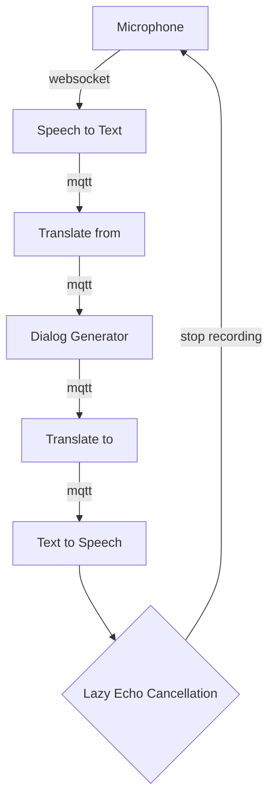

# Gilbert - robot AI framework

## Introduction

The goal of Gilbert project is to offer an open framework to learn and play easily with machine learning and robotics.

Current development status:
1. Gilbert is listening to you and can have a discussion with you if you have a microphone on your computer

## Features

Several modules are available:
- Speech to text
- Text to speech
- Text translation
- Dialog generation

We are working on the following modules:
- Concept keyword extraction
- Paraphrase generator
- Telemetry and tooling to view Gilbert metrics and statuses


Modules are connected through MQTT with a simple protocol. It means you can easily replace any module or distribute Gilbert modules amongst many machines. (For example you can run the dialog generation module on a GPU assisted computer).

## Architecture



## Requirements

- Docker (ensure you allocate at least 4GB of ram for docker)
- docker-compose
- Python3 and pip

## Installation

1. Get code
```
git clone git@github.com:bjorand/gilbert.git
cd gilbert

```

2. Install python dependencies

With `pipenv`:

```
pip install pipenv
pipenv install
```

3. Download Speech to Text model

Download Vosk model for your language (https://alphacephei.com/vosk/models). For example for french speech to text:

```
# cd into gilbert git repository
wget https://alphacephei.com/vosk/models/vosk-model-fr-0.22.zip
unzip vosk-model-fr-0.22.zip
ln -s vosk-model-fr-0.22 vost-model
```

## Getting started

1. Start the speech to text module and the MQQT server:

```
docker compose up --build
```

2. Start the microphone module

```
pipenv run modules/microphone.py
```

3. Start the translate module

```
pipenv run modules/translate.py
```

4. Start the dialog module

```
pipenv run modules/dialog.py
```

5. Start the text to speech module

```
pipenv run modules/tts.py
```

6. Start the synapse module

```
pipenv run modules/synapse.py
```

## MQQT protocol specifications

### Status

Topics:

- `status/talking` (value: `1` or `0`) Text To Speech is running (used for example for Lazy Echo Cancellation)

### Dialog generation

### Request

Topic: `dialog/request/<cliend_id>`

```
{
    "input": "Hello, how are you?"
}
```

#### Response:

{
    "output": "I'm fine and you?"
}

### Translate

#### Request

Topic: `module/translate/request/<cliend_id>`

```
{
    "from": "en",
    "to": "fr",
    "text": "Hello"
}
```

#### Response:

Topic: `translate/response/<cliend_id>`

```
{
    "text": "Bonjour"
}
```
### TTS (Text to speech)

#### Request

Topic: `module/tts/request/<cliend_id>`

```
{
    "lang": "en",
    "text": "Hello"
}
```

#### Status:

Topic: `status/speaking/<cliend_id>`

```
{
    "speaking": true
}
```


## Misc

### Offline & online

Gilbert _should_ able to run fully offline. Some modules like Text to Speech is using Google API but can degrade to the local TTS if internet is unreachable.


### Lazy echo cancellation

Instead of relying on the audio device or driver to prevent echo while playing and recording, Gilbert stops recording when he is speaking.
TODO: maybe continue recording but ignore Gilbert sentences. Or use some form of voice type recognition and ignore it.

